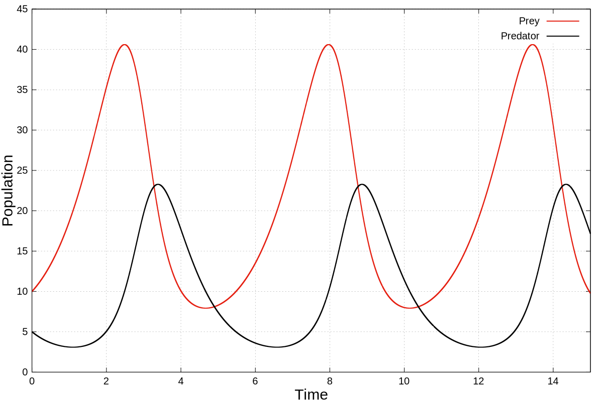
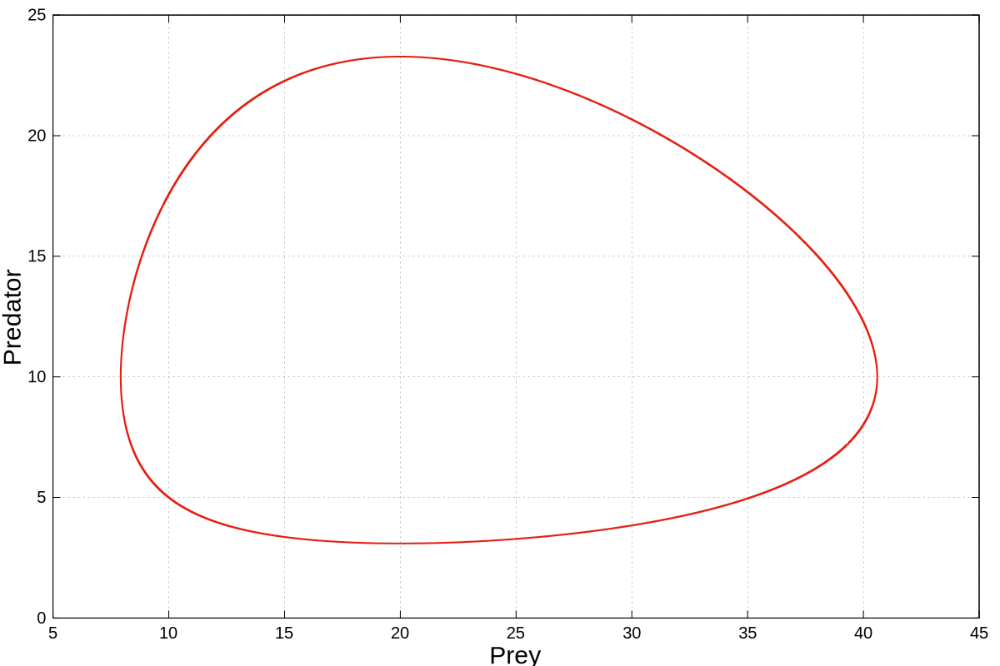

<h1 align="center" >Simulation of Lotka-Volterra model in C++ using RK4</h1>
<p align="center">
<a href="https://en.wikipedia.org/wiki/Lotka%E2%80%93Volterra_equations"></a>
<a href="https://en.wikipedia.org/wiki/Differential_equation"></a>
<a href="https://en.wikipedia.org/wiki/Runge%E2%80%93Kutta_methods"></a>
<a href="https://en.wikipedia.org/wiki/Runge%E2%80%93Kutta_methods"></a>
<a href="https://en.wikipedia.org/wiki/Computer_simulation"></a>
</p>

<p align="center">
<a href="https://en.wikipedia.org/wiki/C%2B%2B"></a>
<a href="https://en.wikipedia.org/wiki/Theoretical_ecology"></a>
</p>

<h2>Brief summary</h2>
Alfred J. Lotka and Vito Volterra independently developed a simple model of predator-prey interaction, which consists of two coupled first-order differential equations with four parameters. Owing to oversimplification, the model is quite unrealistic but it's a good candidate for getting a first hand at solving coupled non-linear differential equations.
In this repository, the Lotka-Volterra model is numerically solved using Runge-Kutta method of 4<sup>th</sup> order, commonly knows as rk4, <em>from-zero</em> in C++.  
<h2>File description</h2>
Repository contains 5 files, whose descriptions are as follows:
<table border="0">
      <tr>
				<td>1.</td>
				<td><b>Lotka-volterra.cpp</b></td>
				<td> C++ script</td>
			</tr>
			<tr>
				<td>2.</td>
				<td><b>output.dat</b></td>
				<td>Sample output</td>
			</tr>
			<tr>
				<td>3.</td>
				<td><b>plot1.svg & plot2.svg</b></td>
				<td>Plot from output.dat</td>
			</tr>
			<tr>
				<td>4.</td>
				<td><b>plot.gnu</b></td>
				<td>Gnuplot script</td>
			</tr>
</table>	

<h2>Usage</h2>
Run the following commands on the terminal.

```bash
Linux@Linux:~$ lotka-volterra.cpp
Linux@Linux:~$ ./a.out
```

<h2>Output</h2>
<p>Program will produce a text file "output.dat", which will be of following format.</p>

```text
#               Time                Prey            Predator
    0.0000000000e+00    1.0000500031e+01    4.9996250234e+00
    1.0000000000e-04    1.0001000125e+01    4.9992500937e+00
    2.0000000000e-04    1.0001500281e+01    4.9988752109e+00
    3.0000000000e-04    1.0002000500e+01    4.9985003750e+00
    4.0000000000e-04    1.0002500781e+01    4.9981255859e+00
                ....                ....                ....
                ....                ....                ....
                ....                ....                ....
                ....                ....                ....
    1.4999600000e+01    9.7821057392e+00    1.7170535203e+01
    1.4999700000e+01    9.7814043993e+00    1.7169219358e+01
    1.4999800000e+01    9.7807032385e+00    1.7167903524e+01
    1.4999900000e+01    9.7800022566e+00    1.7166587700e+01
    1.5000000000e+01    9.7793014536e+00    1.7165271886e+01

```
<h2>Plots</h2>

<p align="center">
	 
<p align="center">Time series plot with parameter alpha = 1, beta = .1, eta = 1.5, delta =.75, h = 1e-4, prey = 10 and predator = 5</p>
</p>


<p align="center">

<p align="center">Trajectory in phase space with parameter alpha = 1, beta = .1, eta = 1.5, delta =.75, h = 1e-4, prey = 10 and predator = 5</p>
</p>


<h2 id="Contact">Contact</h2>
<a href="https://twitter.com/hamiltonianaman" > </a>
<a href="https://github.com/zoologistaman" > </a> 


<h2 id="License">License</h2>
Distributed under <a href="https://github.com/git/git-scm.com/blob/main/MIT-LICENSE.txt">MIT License</a>

<h2> References </h2>

[1]  Weisstein, Eric W. "Runge-Kutta Method."<a href="https://mathworld.wolfram.com/Runge-KuttaMethod.html">From MathWorld--A Wolfram Web Resource.</a>

[2] Lotka, A. J. (1925). Elements of physical biology. Williams & Wilkins.

[3] Volterra, V. (1926). Variazioni e fluttuazioni del numero d'individui in specie animali conviventi.
